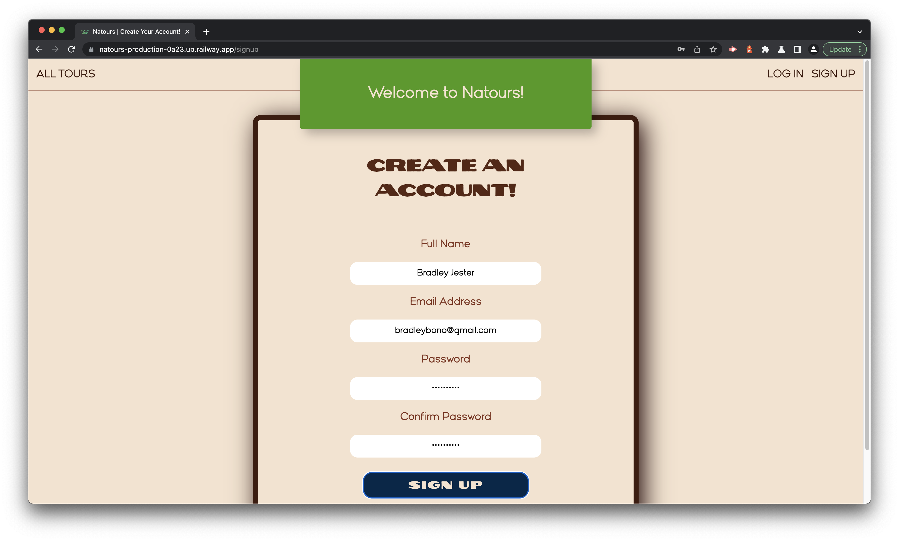
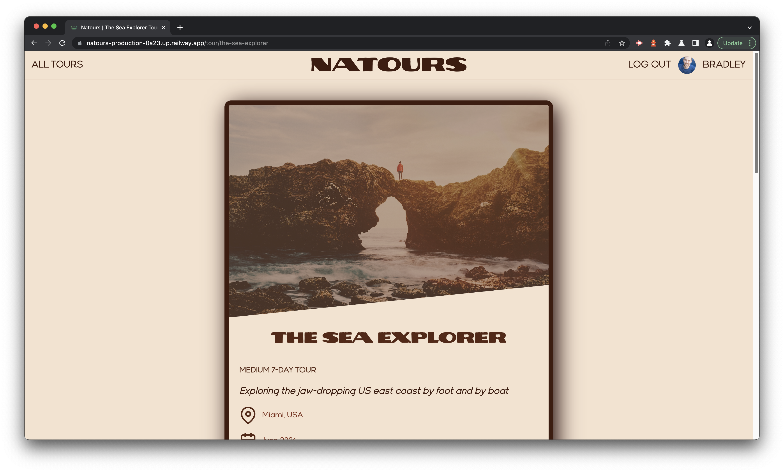
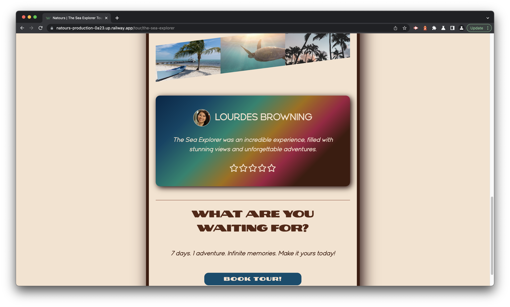
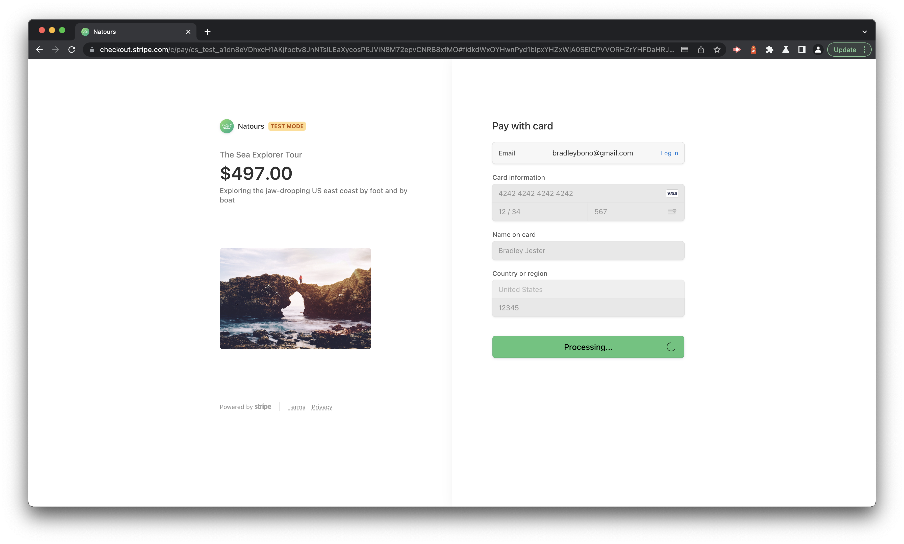
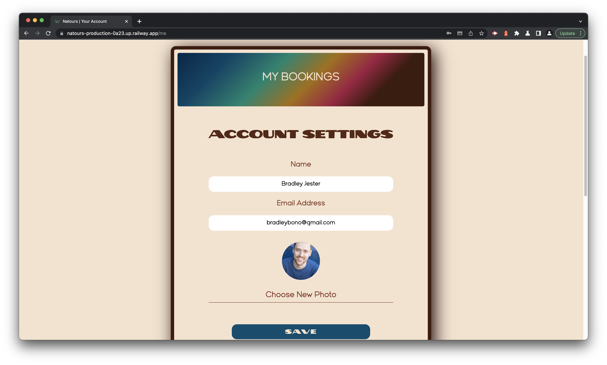
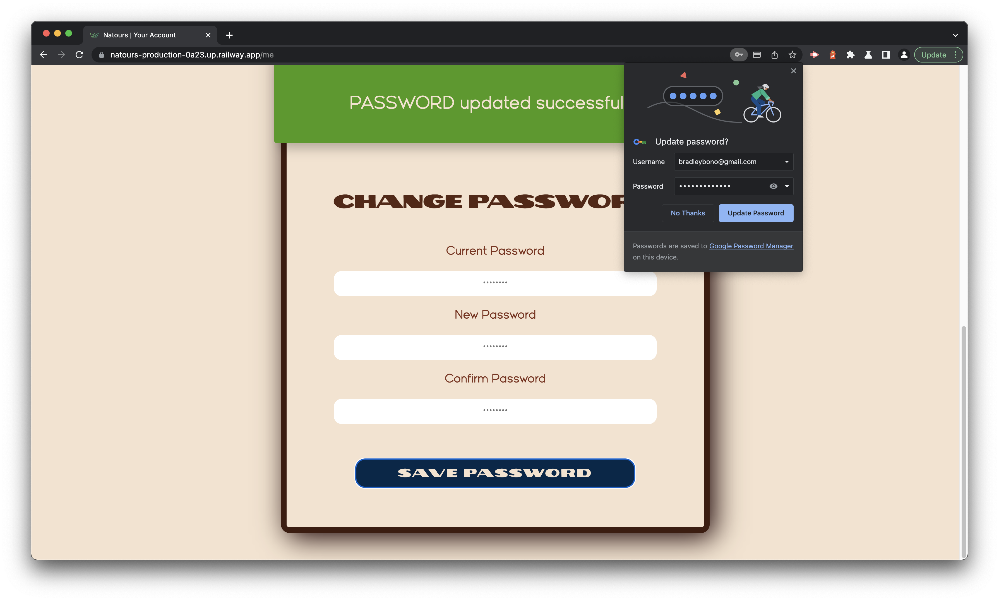

# Natours

## License

 

 

## Deployment Link

 

[Natours](https://natours-production-0a23.up.railway.app)

 

## Table of Contents

 

- [Natours](#natours)
  - [License](#license)
  - [Deployment Link](#deployment-link)
  - [Table of Contents](#table-of-contents)
  - [Description](#description)
  - [Installation](#installation)
  - [Usage](#usage)
  - [Badges](#badges)
  - [Questions](#questions)

<small><i><a href='http://ecotrust-canada.github.io/markdown-toc/'>Table of contents generated with markdown-toc</a></i></small>

 

## Description

 

Built with CSS, Express.js, JavaScript, MongoDB, Node.js, and Pug templates, **Natours** is a tour booking site that allows users to browse nature tours, "purchase" tours they wish to buy, view tours they've booked, update their login credentials/profile picture, and so much more!

 

## Installation

 

Clone the repository to your local machine, open your terminal, and navigate to the root folder in the **Natours** repository. To install the necessary dependencies, run `npm i` in your command-line terminal.

 

## Usage

 

 

To view the **Natours** home page navigate to this link:

 

[Natours](https://natours-production-0a23.up.railway.app)

 

 

To create an account with **Natours** enter your full name, a valid email address, a secure password (that's at least 8 characters), confirm your password, and press the `SIGN UP` button.

 

 

To log into **Natours** simply enter your email address, password, and press the `LOGIN` button.

 

 

 

 

To view a tour navigate to the home page and click on the `DETAILS` button underneath it. To go back to the home page click on the `All Tours` navigation bar link in the upper left-hand corner of the screen. To book a tour simply click on the `BOOK TOUR` button at the bottom of that tour's page.

 

 

If you wish to "purchase" a tour follow these steps:

1. Under `Card information` type **4242 4242 4242 4242** for the card number, **12/34** for the expiration date, and **567** for the CVC.
2. Under `Name on card` feel free to enter any name you wish.
3. Under `Country or region` use **United States** for the country/region and **12345** for the ZIP Code.
4. Press the `Pay` button and wait a few seconds for the transaction to process.
5. You're all set! Congratulations on booking your first tour!

 

 

To view your bookings click on your profile picture in the upper right-hand corner of the screen. Then, at the top of the screen, underneath **Settings**, you should see **My Bookings**. If you click on it you'll be redirected to a page with the tour you just booked.

 

 

To update your profile picture click on the `Choose New Photo` button in **Account Settings** (to navigate to **Account Settings** click on your profile picture in the upper right-hand corner of the screen just like you did to view your bookings), select an image file, and press `Upload`. Finally, press the `SAVE` button!

 

 

To change your password click on your profile picture in the upper right-hand corner of the screen, scroll down to the bottom where it says `Change Password`, type your current password, your new password, and confirm it. Finally, press the `SAVE` button and you're all set!

 

## Badges

 

 

 

 

 

 

 

 

 

 

 

 

 

## Questions

 

If you have any additional questions, you can reach me at:

 

bradleyjester0@gmail.com
